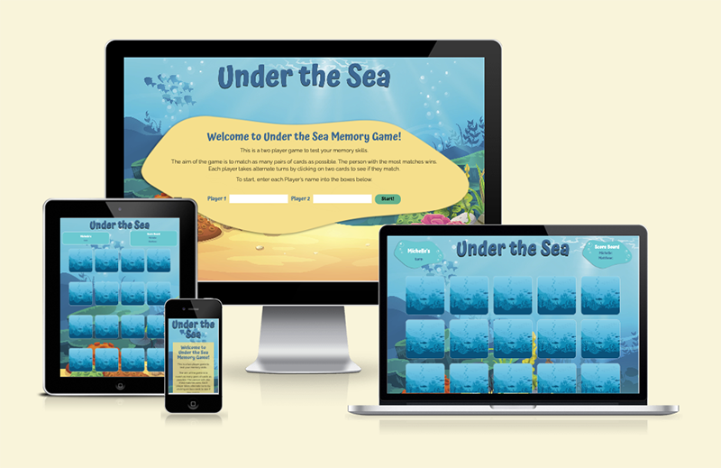
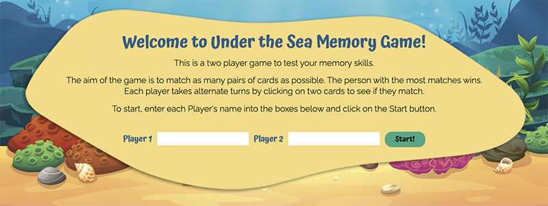
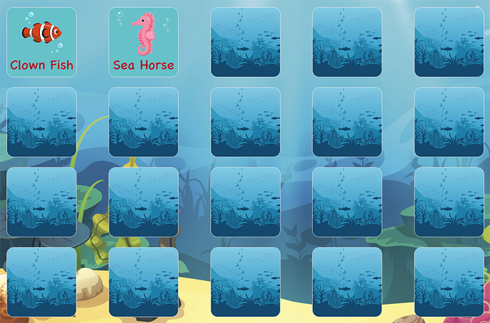
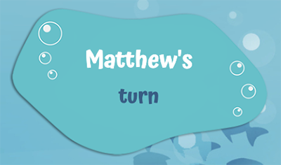
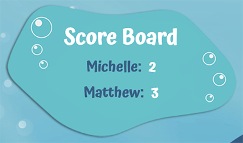

# Portfolio Project 2 - Under the Sea Memory Game

The Under the Sea Memory Game is an interactive game for two players. The purpose of the game is to beat your opponent by matching the most pairs of cards. The game is targeted towards young children, as it is simple to follow and encourages them to use their memory to win, although can be enjoyed by people of any age! 

It has been built using HTML, CSS and JavaScript and is responsively designed allowing users to play it on a range of devices.

[View Under the Sea on GitHub Pages](https://michellebritton.github.io/under-the-sea/)

## CONTENTS

- [Features](#features)
    - [Existing Features](#existing-features)
    - [Features Left to Implement](#features-left-to-implement)
- [Design](#design)
    - [Colour Scheme](#colour-scheme)
    - [Typography](#typography)
    - [Imagery](#imagery)
    - [Wireframes](#wireframes)
    - [Features](#features)
    - [Accessibility](#accessibility)
- [Technologies Used](#technologies-used)
    - [Languages Used](#languages-used)
    - [Programs Used](#programs-used)
- [User Experience](#user-experience)
    - [User Stories](#user-stories)
- [Testing](#testing)
    - [W3C Validator](#w3c-validator)
    - [Jigsaw CSS Validator](#jigsaw-css-validator)
    - [Solved Bugs](#solved-bugs)
    - [Known Bugs](#known-bugs)
    - [Testing User Stories](#testing-user-stories)
    - [Lighthouse](#lighthouse)
    - [Full Testing](#full-testing)
- [Deployment](#deployment) 
- [Credits](#credits)
    - [Code Used](#code-used)
    - [Content](#content) 
    - [Media](#media) 
- [Acknowledgments](#acknowledgements)

## Features
### Existing Features
#### Heading
The heading is located centrally at the top of the page using a large font with a text shadow so that it stands out from the background image enabling the user to see the name of the game easily.

#### Welcome Panel 
The welcome panel is the initial screen that you see when you visit the site. It contains information explaining the aim of the game, how to play the game and how to get started. To start playing the game, it requires the two players to enter their names into the input boxes and click on the "Start" button. If they do not complete both boxes, an alert will appear asking them to fill in both fields. Once the button is clicked, the welcome panel will fade out and the grid of cards will appear.

#### The Game Area
There is a grid of 20 cards. Initially, only the back of the cards are shown. When the user clicks on a card it will flip over to reveal an image. The user must click on two cards at a time to see if they match. If they don't match, the cards will flip back over to their original state. If they do match, a pop up will appear telling them that they have a match.

#### Player's Turn Board
The panel in the top left hand corner indicates whose turn it currently is. This will automatically change when either the cards are returned to their original state or after the pop up has disappeared.

#### Score Board
The Score Board is located in the top right hand corner. It displays both of the player's names and indicates their current score, which is updated when a user has finished their turn.

### Features Left to Implement

