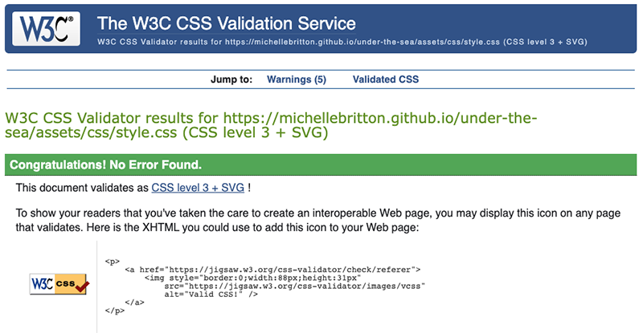

# Portfolio Project 2 - Under the Sea Memory Game

The Under the Sea Memory Game is an interactive game for two players. The purpose of the game is to beat your opponent by matching the most pairs of cards. The game is targeted towards young children, as it is simple to follow and encourages them to use their memory to win, although can be enjoyed by people of any age! 

It has been built using HTML, CSS and JavaScript and is responsively designed allowing users to play it on a range of devices.

[View Under the Sea on GitHub Pages](https://michellebritton.github.io/under-the-sea/)

## CONTENTS

- [Features](#features)
    - [Existing Features](#existing-features)
    - [Features Left to Implement](#features-left-to-implement)
- [Design](#design)
    - [Colour Scheme](#colour-scheme)
    - [Typography](#typography)
    - [Imagery](#imagery)
    - [Wireframes](#wireframes)
    - [Accessibility](#accessibility)
- [Technologies Used](#technologies-used)
    - [Languages Used](#languages-used)
    - [Programs Used](#programs-used)
- [Testing](#testing)
    - [Validator Testing](#validator-testing)
    - [Solved Bugs](#solved-bugs)
    - [Unfixed Bugs](#unfixed-bugs)
    - [Lighthouse](#lighthouse)
    - [Full Testing](#full-testing)
- [Deployment](#deployment) 
- [Credits](#credits)
    - [Code Used](#code-used)
    - [Content](#content) 
    - [Media](#media) 
- [Acknowledgments](#acknowledgements)

## Features
### Existing Features
#### Heading
The heading is located centrally at the top of the page using a large font with a text shadow so that it stands out from the background image enabling the user to see the name of the game easily.

#### Welcome Panel 
The welcome panel is the initial screen that you see when you visit the site. It contains information explaining the aim of the game, how to play the game and how to get started. To start playing the game, it requires the two players to enter their names into the input boxes and click on the "Start" button. If they do not complete both boxes, an alert will appear asking them to fill in both fields. Once the button is clicked, the welcome panel will fade out and the grid of cards will appear.

#### The Game Area
There is a grid of 20 cards. Initially, only the back of the cards are shown. When the user clicks on a card it will flip over to reveal an image. The user must click on two cards at a time to see if they match. If they don't match, the cards will flip back over to their original state. If they do match, a pop up will appear telling them that they have a match.

#### Player's Turn Board
The panel in the top left hand corner indicates whose turn it currently is. This will automatically change when either the cards are returned to their original state or after the pop up has disappeared.

#### Score Board
The Score Board is located in the top right hand corner. It displays both of the player's names and indicates their current score, which is updated when a user has finished their turn.

#### Pop Ups
Pop up windows appear when a user successfully matches two cards and also at the end of the game, to indicate who the winner is or to declare the game a draw. 

#### New Game
Underneath the grid is a button, which if clicked on, will reset the grid, score board and player board so that the players can start a fresh game.

### Features Left to Implement
- In the event of a draw, you could present the users with tie break muiltiple choice questions based on a marine theme, such as "What type of fish was Nemo?"

## Design

### Colour Scheme

I chose the theme as I thought the bright colours would be attractive to young children, and if they have seen the film "Finding Nemo" they may find it a little more interesting. The colours used throughout the site were chosen as they match the colours contained within the background image.

### Typography

The fonts used were imported from Google Fonts. The main font used throughout the site is Atma, whilst Raleway has been used for the paragraphs contained within the Welcome Panel

### Imagery

Images used throughout the site were purchased from [iStock](https://www.istockphoto.com/).

### Wireframes

A wireframe was created using the [Figma website](https://www.figma.com/).

[Under the Sea wireframe](https://www.figma.com/proto/RlWv7VijrgxyrQ0Vkw2zgw/Under-the-Sea?type=design&node-id=19-84&scaling=min-zoom&page-id=14%3A2&starting-point-node-id=19%3A84)

### Accessibility 

To ensure that the website is as accessible as possible, I have: 

- Used semantic HTML to structure and organise content
- Provided alt attributes for all images 
- Ensured that there is a good colour contrast throughout the site whilst maintaining the integrity of the design 

## Technologies Used 
### Languages Used 
This website was built with HTML, CSS and JavaScript.

### Programs Used

- [Figma](https://www.figma.com/) - for creating wireframes
- [Git](https://git-scm.com/) - a version control system for tracking changes
- [GitHub](https://github.com/) - a code hosting platform for version control
- [Gitpod](https://www.gitpod.io/) - a cloud development environment
- [GitHub Pages](https://pages.github.com/) - for deployment of website
- [Google Fonts](https://fonts.google.com/) - catalogue of open source fonts
- [TinyPNG](https://tinypng.com/) - to compress images
- [Am I Responsive?](https://ui.dev/amiresponsive) - to generate a screenshot of the website on multiple devices
- [Shields](https://shields.io/) - to generate badges for inclusion in the README field
- [Chrome Developer Tools](https://developer.chrome.com/docs/devtools/) - for testing and debugging the website
- [Lighthouse](https://developer.chrome.com/docs/lighthouse/overview/) - for accessibility and performance reporting
- [The W3C Markup Validation Service](https://validator.w3.org/) - for validating HTML 
- [Jigsaw](https://jigsaw.w3.org/css-validator/) - for validating CSS
- [JSHint](https://jshint.com/) - for validating JavaScript
- [Browserstack](https://www.browserstack.com/) - for cross browser testing

## Testing
Chrome Developer Tools were used throughout the course of development, the console was particularly useful when debugging the code.

### Validator Testing

W3C HTML Validation
No errors were returned when passing through the official W3C Validator.

Jigsaw CSS Validator
No errors were found when passing through the official Jigsaw validator.

JavaScript
No errors were found when passing through the official Jshint validator.

The following metrics were returned: 
- There are 25 functions in this file.
- Function with the largest signature take 1 arguments, while the median is 0.
- Largest function has 14 statements in it, while the median is 3.
- The most complex function has a cyclomatic complexity value of 5 while the median is 1.

### Solved Bugs
I found the following issues during testing. 

- If you click on the same card twice, it alerts you that there is a match.
- After clicking on two cards, it is possible to carry on clicking on other cards.

### Unfixed Bugs
No unfixed bugs.

## Deployment 

GitHub Pages was used for deployment of the website directly from the GitHub repository by following these steps: 

- Log in to GitHub
- Locate the repository that you are deploying
- Click on "Settings"
- Click on "Pages"
- Select the source to deploy from, in this case it was "Deploy from a branch"
- Select the branch, in this case it was the "main" branch
- Select the root folder
- Click on "Save".  It may take a few minutes but your site is now live and the URL will appear.

## Local Development
To create a local copy of the repository by cloning it:

- Log in to GitHub
- Locate the repository that you are cloning
- Click on "Code"
- Select the method of cloning and copy the link shown
- Open the terminal and change the current working directory to the location you want to use for the cloned directory.
- Type "git clone" into the terminal and paste the link that you copied and press Enter

To fork the repository: 
- Log in to GitHub
- Locate the repository
- Click on the "Fork" button at the top
