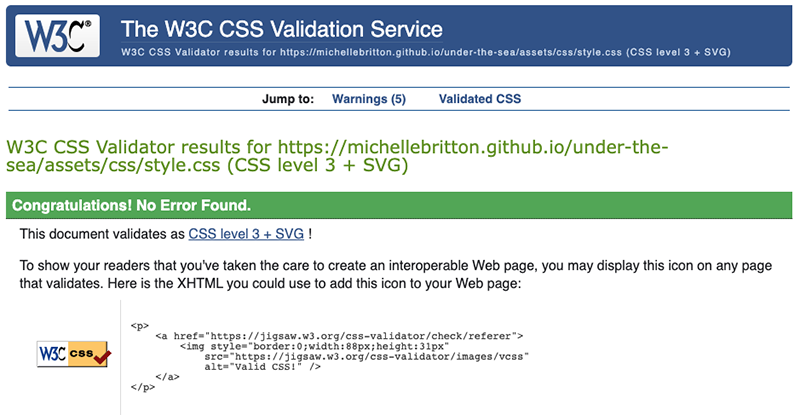

# Portfolio Project 2 - Under the Sea - Testing Documentation

Visit the deployed site: [Under the Sea](https://michellebritton.github.io/under-the-sea/)

## CONTENTS

- [AUTOMATED TESTING](#automated-testing)
    - [W3C Validator](#w3c-validator)
    - [Jigsaw CSS Validator](#jigsaw-css-validator)
    - [JavaScript Validator](#javascript-validator)
    - [Lighthouse](#lighthouse)

- [MANUAL TESTING](#manual-testing)
    - [Full Testing](#full-testing)
    - [Known Bugs](#known-bugs)
    - [Solved Bugs](#solved-bugs)

## AUTOMATED TESTING

### [W3C HTML Validation](https://validator.w3.org/nu/?doc=https%3A%2F%2Fmichellebritton.github.io%2Funder-the-sea%2F)
No errors were returned when passing through the official W3C Validator.

### [Jigsaw CSS Validator](https://jigsaw.w3.org/css-validator/validator?uri=https%3A%2F%2Fmichellebritton.github.io%2Funder-the-sea%2Fassets%2Fcss%2Fstyle.css&profile=css3svg&usermedium=all&warning=1&vextwarning=&lang=en)
No errors were found when passing through the official Jigsaw validator.

### [JavaScript Validator](https://jshint.com/)
No errors were found when passing through the official Jshint validator.

The following metrics were returned: 
- There are 26 functions in this file.
- Function with the largest signature take 1 arguments, while the median is 0.
- Largest function has 16 statements in it, while the median is 3.
- The most complex function has a cyclomatic complexity value of 5 while the median is 1.