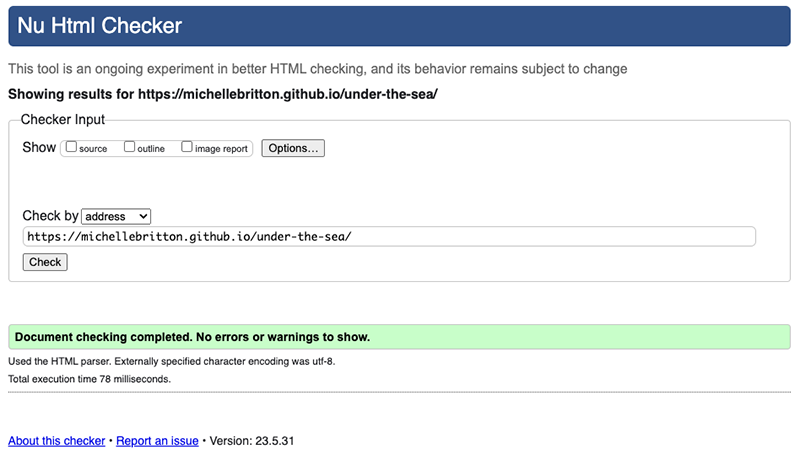

# Portfolio Project 2 - Under the Sea - Testing Documentation

Visit the deployed site: [Under the Sea](https://michellebritton.github.io/under-the-sea/)

## CONTENTS

- [AUTOMATED TESTING](#automated-testing)
    - [W3C Validator](#w3c-validator)
    - [Jigsaw CSS Validator](#jigsaw-css-validator)
    - [JavaScript Validator](#javascript-validator)
    - [Lighthouse](#lighthouse)

- [MANUAL TESTING](#manual-testing)
    - [Full List of Tested Browsers](#full-testing-list)
    - [Full Testing Results](#full-testing-results)

## AUTOMATED TESTING

### [W3C HTML Validation](https://validator.w3.org/nu/?doc=https%3A%2F%2Fmichellebritton.github.io%2Funder-the-sea%2F)
No errors were returned when passing through the official W3C Validator.

### [Jigsaw CSS Validator](https://jigsaw.w3.org/css-validator/validator?uri=https%3A%2F%2Fmichellebritton.github.io%2Funder-the-sea%2Fassets%2Fcss%2Fstyle.css&profile=css3svg&usermedium=all&warning=1&vextwarning=&lang=en)
No errors were found when passing through the official Jigsaw validator.

### [JavaScript Validator](https://jshint.com/)
No errors were found when passing through the official Jshint validator.

### Lighthouse

- Initial and final testing for Desktop

- Initial and final testing for Mobile

- Suggestions:
Serve images in next-gen formats such as WebP and AVIF which means faster downloads and less data consumption. I have converted images to WebP format using Birme.

## MANUAL TESTING

### Full Testing List

Full testing was performed on the following: 

- iPhone 13 - Safari and Chrome
- iPhone 14 - Safari and Chrome
- iPHone 14 Pro - Safari and Chrome
- iPhone 14 Plus - Safari and Chrome
- iPhone 12 Mini - Safari and Chrome
- iPhone 8 - Safari and Chrome
- iPad 10th Gen - Safari and Chrome
- iPad Pro 12.9.2020 - Safari and Chrome
- iPad Mini 2019 - Safari and Chrome
- iPad Air 5 - Safari and Chrome
- iPad 5th Gen - Safari and Chrome
- Samsung Galaxy S22 - Chrome and Firefox
- Samsung Galaxy S23 Ultra - Chrome and Firefox
- Samsung Galaxy 8 - Chrome and Firefox
- Samsung Galaxy Note 20 - Chrome and Firefox
- Samsung Galaxy Note 9 - Chrome and Firefox
- Windows 11 - Edge 112
- Windows 11 - Edge 109
- Windows 11 - Firefox 112
- Windows 11 - Chrome 112
- Windows 11 - Opera 98
- Windows 10 - Edge 112
- Windows 10 - IE 11
- Windows 10 - Firefox 112
- Windows 10 - Chrome 112
- Windows 10 - Opera 98
- Windows 7 - Edge 109
- Windows 7 - IE 11
- Windows 7 - Firefox 112
- Windows 7 - Chrome 109
- Windows 7 - Opera 95
- Mac Ventura - Safari 16.3
- Mac Ventura - Chrome 112
- Mac Ventura - Firefox 112
- Mac Ventura - Opera 98
- Mac Ventura - Edge 112
- Mac Sierra - Safari 10.1
- Mac Sierra - Firefox 112
- Mac Sierra - Chrome 103
- Mac Sierra - Opera 89
- Mac Sierra - Edge 103

### Full Testing Results

| Feature:  | Welcome Panel           |
|-----------|-------------------------|
| Expected: | Enter the player's names and click on Start. The welcome panel should then disappear. If you click on Start without entering anything into the input boxes, an alert should appear.|
| Testing:  | Tested the feature by firstly clicking on Start without completing the the input boxes. Secondly, completing the input boxes and clicking on Start.|
| Result:   | The feature responded as expected.|
| Fix:      | No fix needed.|

| Feature:  | Game Area               |
|-----------|-------------------------|
| Expected: | A grid of 20 cards appear. You should be able to click on two cards at a time. If there is a match, a pop up will appear telling you that it is a match.  If there is no match, the cards flip back over to their original state.|
| Testing:  | Tested the feature by firstly clicking on two cards. Secondly, clicking on more than two cards at a time. Thirdly, double clicking on one card.|
| Result:   | The feature responded as expected when two cards are clicked on. It allowed you to click on more than two cards per turn. Double clicking on a card resulted in a pop up saying you had a (false) match.|
| Fix:      | To prevent more than two cards being clicked on, I created a variable called isPlaying initially set to true. In the flip function, a check is made to see if the variable is false and if it is then exit the function. Once two cards have been clicked the variable is set to false. The variable is then reset to true after the cards have been checked for a match.To prevent a card being double clicked on, I added a class of "stopClick" to cards clicked on. A disableClick function was then created which removes the click event listener for elements with a class name of "stopClick". Once the cards have been checked for a match, the class is removed and the flipCards function is called, so that the click event listeners are recreated.|

| Feature:  | Player's Turn Board     |
|-----------|-------------------------|
| Expected: | Feature is expected to indicate which player's turn it currently is by changing when either the cards are returned to their original state or after the pop up has disappeared. |
| Testing:  | Tested the feature by playing the game and noting each change of player.|
| Result:   | The feature responded as expected.|
| Fix:      | No fix needed.|

| Feature:  | Score Board             |
|-----------|-------------------------|
| Expected: | Feature is expected to update the score when a player matches a card.|
| Testing:  | Tested the feature by playing the game and noting the score when each match has been made.|
| Result:   | The feature responded as expected.|
| Fix:      | No fix needed.|

| Feature:  | Pop ups                 |
|-----------|-------------------------|
| Expected: | Feature is expected to pop up each time there is a match of cards. The message will say "It's a Match!". The pop up will also appear at the end of the game to notify you of the winner.  The message will say "[Name] is the Winner!" or "It's a draw!"|
| Testing:  | Tested the feature by playing the game and noting whether the pop up appears, and whether it contains the correct message.|
| Result:   | The feature responded as expected.|
| Fix:      | No fix needed.|

| Feature:  | New game                |
|-----------|-------------------------|
| Expected: | Feature is expected to make the grid disappear and reappear with a new batch of shuffled cards. The Player's Turn Board will reset to Player 1 and the Score Board will reset to 0.|
| Testing:  | Tested the feature by clicking on the new game button, and checking in Chrome Developer Tools whether the order of the cards had changed from the previous grid. Checked both the Player's Turn Board and the Scoreboard to see that they had both reset.|
| Result:   | The feature responded as expected.|
| Fix:      | No fix needed.|